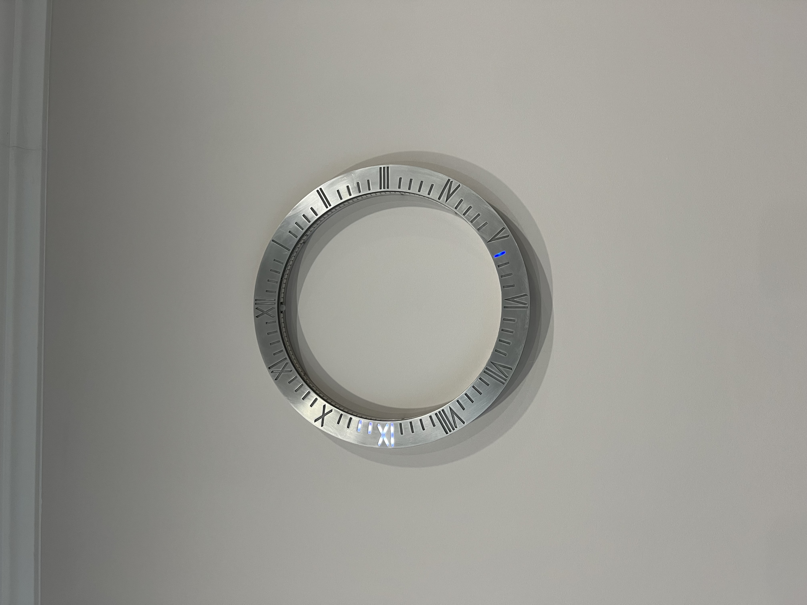

# CircleWatch

## Description
This repository contains the source code for multifunctional wall clock designed from scratch using [Seed xiao ESP32C3](https://www.seeedstudio.com/Seeed-XIAO-ESP32C3-p-5431.html) board as the core. 
Concept of design was to use the minimalistic thin dial with rgb led highlighting for time indication. Besides time the watch can be used as a smart lamp by using thick packed led strip. 
Circle watch also have various settings for customization like changing time mode, color scheme for indication, changing deep-sleep time for effective energy consumption etc.
The watch is controlled via Bluetooth Low Energy.

## Real device images



## Instalation
To build/load this project for ESP32 platform we need just to instal VS Code and [PlatformIO](https://platformio.org/) extension and clone the repo.

## BLE commands

### Set time
Command for setup the actual time for watch. Command with parameter for time in format hh:mm (exm. 22:05)
```bash
/set_time <hh::mm>
```
### Set hour color
Command for setting the color of hour light. Command with parameter for color in format r,g,b (exm. 255, 34, 123). Each value in range 0..255
```bash
/set_hour_color <r,g,b>
```
### Set minutes color
Command for setting the color of minutes light. Command with parameter for color in format r,g,b (exm. 255, 34, 123). Each value in range 0..255
```bash
/set_min_color <r,g,b>
```

### Set default colors for hour and minute
Command for setting default colors for hour (white) and minute (blue) indication
```bash
/dial_default_colors
```

### Set brightness for dial
Command for setting brightness for dial
```bash
/dial_brightness
```

### Light rainbow on
Command for turning on the light in rainbow colors with dynamic change
```bash
/light_rainbow_mode
```
### Light white cold on
Command for turning on the light in white cold color
```bash
/light_white_cold_mode
```

### Light warm cold on
Command for turning on the light in white cold color
```bash
/light_white_warm_mode
```

### Light custom color on
Command for turning on the light with custom color.
Command with parameter for color in format r,g,b (exm. 255, 34, 123). Each value in range 0..255
```bash
/light_custom_mode <r,g,b>
```

### Light brightness
Command for changing the light brightness.
Command with parameter of one integer value in range 0..255
```bash
/light_brightness <value>
```

### Light off
Command for turning off the light
```bash
/light_off
```

### Dial digit hour mode
Command for setting one digit for indicating the hour value
```bash
/dial_digit_hour
```

### Dial segment hour mode
Command for setting segment (Digit and four divisions after) for indicating the hour value.
Segment grow up with minutes, each division per 12 minutes
```bash
/dial_segment_hour
```

### Set active watch time before deep sleep
Command for setting the active time of watch after detecting the nearby human before going to deep sleep mode.
This functionality useful for low energy consumption.
Command with parameter of one integer value in range 0..2,147,483,647
```bash
/set_deep_sleep_time <value>
```

### Restart
Command for restarting the watch
```bash
/restart
```
